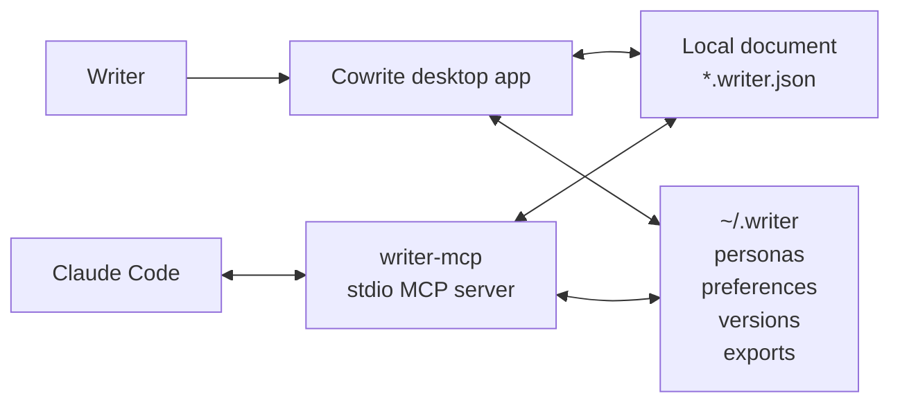
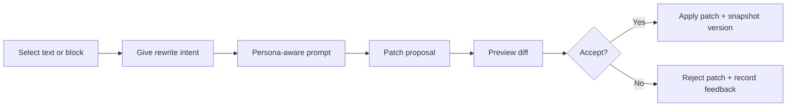

# Cowrite

<div align="center">
  <p><strong>Persona-aware writing, local-first documents, and preview-first AI editing.</strong></p>
  <p>Cowrite is an AI-native desktop writing environment where Claude Code edits structured documents through MCP instead of brittle DOM automation.</p>
  <p>
    
    
    
    
  </p>
  <p>
    <a href="#why">Why</a> ·
    <a href="#what-you-get">What You Get</a> ·
    <a href="#quick-start">Quick Start</a> ·
    <a href="#architecture">Architecture</a> ·
    <a href="#using-cowrite-from-claude-code">Claude Code</a>
  </p>
</div>

> [!NOTE]
> Cowrite is an early-stage product prototype. The desktop app is the main experience today, and the VS Code companion is planned but not yet a primary workflow.

## In 30 Seconds

- Cowrite is built for iterative writing, not one-shot text generation.
- The desktop app owns the editor, review flow, and version history.
- Claude Code works through `writer-mcp`, so it edits blocks, selections, comments, and patches instead of scraping the browser.
- Documents stay local as structured JSON, while personas and feedback signals stay on the same machine.
- AI changes are previewed before apply, with explicit accept and reject paths.

## Quick Start

If you just want to run the project:

```bash
bun install
bun run dev
```

If you only want the local MCP server:

```bash
bun run dev:mcp
```

If you want the browser-only UI during frontend work:

```bash
bun run dev:web
```

## Why

Most AI writing tools optimize for generation. Cowrite is designed for revision.

- Model the writer, not just the prompt, with personas, hard rules, liked and disliked phrases, and style examples.
- Keep documents in an app-owned block format so edits happen with structure and intent.
- Let the app stay in control with patch preview, version snapshots, and explicit approval.
- Keep the workflow local-first so drafts, personas, and preference signals do not need to leave the machine.

## What You Get

- A BlockNote-based editor for block-first drafting, restructuring, and revision.
- A persona studio for tone controls, phrase preferences, hard rules, and style examples.
- Annotation-linked threads so feedback can stay attached to specific parts of a document.
- Preview-first rewrites that can be inspected before they touch the draft.
- A local `writer-mcp` server that gives Claude Code a safe, structured editing surface.
- A shared canonical document model across the desktop app, MCP server, and storage layer.
- Version snapshots, Markdown export, and feedback signals that can later refine persona behavior.

## Architecture



Cowrite separates the writing experience from the AI control surface. The desktop app owns the editor and review UX, `writer-core` owns the document and patch model, `writer-storage` owns local persistence, and `writer-mcp` exposes safe operations to Claude Code.

### Editing Loop



The important design choice is that the agent never becomes the editor. It proposes structured changes, and Cowrite keeps the final say.

## Monorepo Layout

| Path | Responsibility |
| --- | --- |
| `apps/desktop` | Tauri 2 + React desktop app with the editor, persona panels, and review UI |
| `apps/vscode` | Placeholder for a later-stage VS Code companion |
| `packages/writer-core` | Canonical document schema, block adapters, persona models, patch types |
| `packages/writer-storage` | Local filesystem workspace, snapshots, export paths, bootstrap logic |
| `packages/writer-ai` | Prompt builders and rewrite helpers |
| `packages/writer-mcp` | Local stdio MCP server used by Claude Code |
| `packages/writer-ui` | Shared React UI primitives |

## Getting Started

### Prerequisites

- [Bun](https://bun.sh) 1.1+
- [Rust](https://rustup.rs) toolchain with `cargo` and `rustc`
- Xcode Command Line Tools on macOS

```bash
brew install rustup-init && rustup-init
xcode-select --install
```

### Install

```bash
bun install
```

### Verify desktop environment

```bash
bun run check:desktop-env
```

### Run the desktop app

```bash
bun run dev
```

### Run the MCP server only

```bash
bun run dev:mcp
```

### Run the web UI only

```bash
bun run dev:web
```

### Build and typecheck

```bash
bun run build
bun run typecheck
```

## Using Cowrite from Claude Code

Point Claude Code at the local MCP server:

```json
{
  "mcpServers": {
    "writer-mcp": {
      "command": "bun",
      "args": ["run", "dev:mcp"],
      "cwd": "/path/to/cowrite"
    }
  }
}
```

### What gets stored locally

- The MCP server works against a local `*.writer.json` document in its working directory by default.
- Personas, preference signals, version snapshots, and exports live under `~/.writer/`.
- The desktop app and MCP server share the same canonical document model, so the agent sees structure instead of DOM state.

### MCP Surface

- Documents: `document.list`, `document.read`, `document.create`, `document.export`
- Rewrites and review: `rewrite.selection`, `patch.preview`, `patch.apply`, `patch.reject`
- Structural edits: `block.insert`, `block.delete`, `block.replace`, `block.replace_batch`
- Persona management: `persona.list`, `persona.create`, `persona.activate`, `persona.update`, `persona.delete`, `persona.analyze_style`
- Feedback and discussion: `thread.add_comment`, `preference.record_feedback`
- Resources: `writer://users/local-user/personas`, `writer://users/local-user/active-persona`, `writer://users/local-user/preference-profile`, `writer://docs/<docId>`, `writer://docs/<docId>/threads`, `writer://docs/<docId>/versions`
- Prompts: `rewrite_as_active_persona`, `make_less_ai_like_without_losing_meaning`, `summarize_persona_constraints`

## Product Principles

- Edit in place instead of regenerating the whole draft by default.
- Separate style shaping from meaning preservation.
- Learn from behavior, not only from settings.
- Keep review and approval in the product core, not as optional polish.
- Treat Claude Code as a powerful collaborator, not the source of truth for document state.

## License

Private. All rights reserved.
