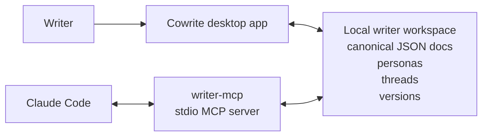

# Cowrite

<div align="center">
  <p><strong>Persona-aware writing, local-first documents, and preview-first AI edits.</strong></p>
  <p>Cowrite is an AI-native desktop editor that lets Claude Code work on structured documents through MCP instead of brittle DOM automation.</p>
  <p>
    
    
    
  </p>
  <p>
    <a href="#why-cowrite">Why</a> ·
    <a href="#what-you-get">What You Get</a> ·
    <a href="#architecture">Architecture</a> ·
    <a href="#getting-started">Getting Started</a> ·
    <a href="#using-cowrite-from-claude-code">Claude Code</a>
  </p>
</div>

> [!NOTE]
> Cowrite is an early-stage product prototype. The desktop app is the primary experience today, and the VS Code companion is still planned.

## Why Cowrite

Most AI writing tools optimize for one-shot generation. Cowrite is built for iterative editing.

- Model the writer, not just the prompt, with personas, hard rules, style examples, and feedback.
- Store documents as structured blocks so AI can edit with intent instead of scraping the DOM.
- Keep the app in control with preview-first patches, version history, and explicit accept/reject flows.
- Run locally so documents, personas, and preference signals stay on the user's machine.

## What You Get

- **Block-based editor** built on BlockNote for Notion-style writing workflows.
- **Persona studio** for tone controls, phrase preferences, hard rules, and style examples.
- **Comment threads and annotations** to anchor feedback to specific parts of a document.
- **Preview-first rewrites** so AI suggestions can be inspected before they are applied.
- **Local MCP server** that exposes document, persona, patch, and thread operations to Claude Code.
- **Shared canonical document model** across the desktop app, storage layer, and MCP surface.

## Architecture



Cowrite keeps the editing experience inside a Tauri desktop app with a BlockNote-based editor while exposing a controlled MCP layer for AI-assisted changes. The desktop app and `writer-mcp` both operate on the same local document model, so the agent sees meaningful structure instead of a browser surface.

## Monorepo Layout

| Path | Responsibility |
| --- | --- |
| `apps/desktop` | Tauri 2 + React desktop app |
| `apps/vscode` | Placeholder for a future VS Code companion |
| `packages/writer-ai` | Prompting and rewrite helpers |
| `packages/writer-core` | Canonical document schema, patch logic, persona models |
| `packages/writer-mcp` | Local stdio MCP server used by Claude Code |
| `packages/writer-storage` | Filesystem persistence and snapshots |
| `packages/writer-ui` | Shared React UI components |

## Getting Started

### Prerequisites

- [Bun](https://bun.sh) 1.1+
- [Rust](https://rustup.rs) toolchain
- Xcode Command Line Tools on macOS

```bash
brew install rustup-init && rustup-init
xcode-select --install
```

### Install

```bash
bun install
```

### Run the desktop app

```bash
bun run dev
```

### Run the MCP server only

```bash
bun run dev:mcp
```

### Build and typecheck

```bash
bun run build
bun run typecheck
```

## Using Cowrite from Claude Code

Point Claude Code at the local MCP server:

```json
{
  "mcpServers": {
    "writer-mcp": {
      "command": "bun",
      "args": ["run", "dev:mcp"],
      "cwd": "/path/to/cowrite"
    }
  }
}
```

### MCP Surface

**Tools**

- `document.list`, `document.read`, `document.create`, `document.export`
- `rewrite.selection`
- `patch.preview`, `patch.apply`, `patch.reject`
- `block.insert`, `block.delete`, `block.replace`, `block.replace_batch`
- `persona.list`, `persona.create`, `persona.activate`, `persona.update`, `persona.delete`, `persona.analyze_style`
- `thread.add_comment`
- `preference.record_feedback`

**Resources**

- `writer://users/local-user/personas`
- `writer://users/local-user/active-persona`
- `writer://users/local-user/preference-profile`
- `writer://docs/<docId>`
- `writer://docs/<docId>/threads`
- `writer://docs/<docId>/versions`

## Product Principles

- **Edit in place, don't regenerate blindly.** Cowrite is designed for targeted revisions, not full-document replacement by default.
- **Separate style from intent.** The agent can help reshape tone and phrasing without casually changing the author's meaning.
- **Learn from behavior.** Accepted, rejected, and manually corrected suggestions are treated as useful preference signals.
- **Keep humans in control.** Patch preview and approval are core to the editing model, not optional polish.

## License

Private - All rights reserved.
